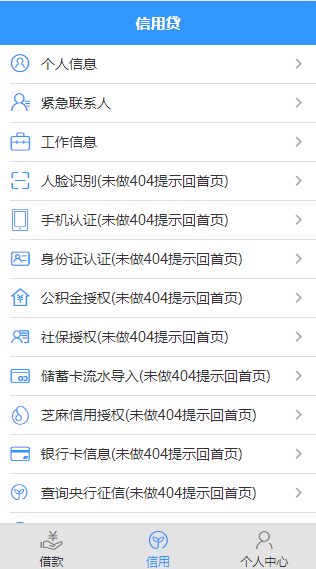
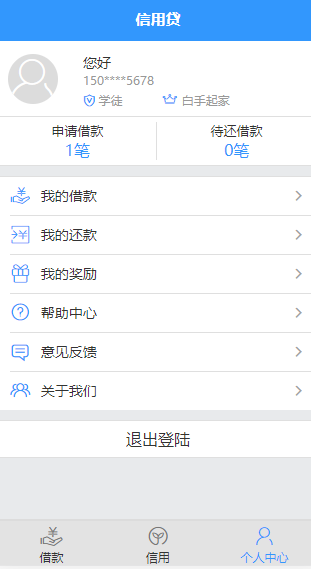
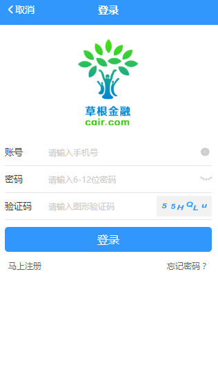
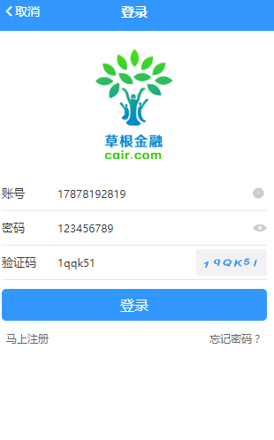
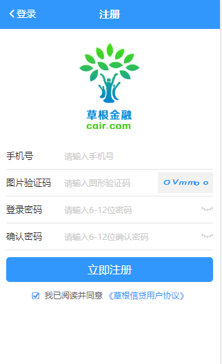

## 团队介绍
### 团队成员与任务划分：
* 组长：陶杰
    
    * 主要工作： app信用界面 app个人中心界面（登陆 注册） 

* 成员：王琳沣
    
    * 主要工作： app首页 后台接口 后台管理系统

* 伴随着互联网的发展，市场对产品的需求越来大，人们的消费水平越来越高。但是人们的消费往往大于收入，为了给人们提供一个消费的后盾，我们的《信用贷》也随之产生。<br>我们的信用贷，无抵押免担保，只需您填写您的真实信息，提芝麻信用、支付宝认证等相关信息，我们将在审核后给予您贷款的资格。

## 目录
* [背景介绍](#背景介绍)
* [项目介绍](#项目介绍)
* [使用说明](#使用说明)
  * [获取代码](#获取代码)
  * [开发插件](#开发插件)

* [项目图片](#项目图片)
  * [首页](#首页)
  * [信用](#信用)
  * [个人中心](#个人中心)
  * [登陆](#登陆)
    * [登陆-1](#登陆-1) 
  * [注册](#注册)


  
<a name="背景介绍"></a>
## 背景介绍

*信用贷*，一款无抵押、免担保的借贷app。

<a name="项目介绍"></a>
## 项目介绍

*信用贷* 的设计初衷是给大家提供一个可方便借贷的平台，充分满足大家的消费需求，且利息并不多。分后端接口和前端UI界面两部分。<br>

由于目前各种借贷平台系统层出不穷，但是他们都有着一个特点就是借贷资金低，利息高的弊端。*信用贷*  正是为了解决此问题而设计的。

伴随着互联网的发展，市场对产品的需求越来大，人们的消费水平越来越高。但是人们的消费往往大于收入，为了给人们提供一个消费的后盾，我们的*信用贷*也随之产生。<br>

我们的信用贷，无抵押免担保，只需您填写您的真实信息，提芝麻信用、支付宝认证等相关信息，我们将在审核后给予您贷款的资格。

<a name="使用说明"></a>
## 使用说明

<a name="获取代码"></a>
### 获取代码

* github项目主页: <https://github.com/gzh51910/xyd/tree/dev>


* Project setup
```
npm install
```

* Compiles and hot-reloads for development
```
npm run dev
```

* Compiles and minifies for production
```
npm run build
```
   
<a name="开发插件"></a>
### 开发插件

在*信用贷*中，插件就像一块一块的积木，不但支撑着框架的功能，也是框架可扩展性的基石。

1.使用vue<br>
2.使用vue-cli脚手架<br>
3.使用vuex<br>
4.使用vueRouter<br>
5.使用element-ui组件<br>
6.使用node.js<br>
7.使用express插件<br>
8.使用axios<br>
9.使用数据库可视化工具<br>
10.使用Mongodb<br>
11.使用git合作开发


<a name="项目图片"></a>
## 项目图片

<a name="首页"></a>
## 首页

```
    首页上部分的轮播图，可以使用小圆进行跳转，也可用鼠标按下轮播区域，用鼠标进行移动切换图片;
    三款借款皆可进行点击进入。
```

<a name="信用"></a>
## 信用

```
    实现了"个人信息"、"紧急联系人"、"工作信息"三个模块的开发。可将用户的信息保存如数据库中。且在数据库后台进行修改 。
```

<a name="个人中心"></a>
## 个人中心



<a name="登陆"></a>
## 登陆


<a name="登陆-1"></a>
## 登陆-1



<a name="注册"></a>
## 注册
